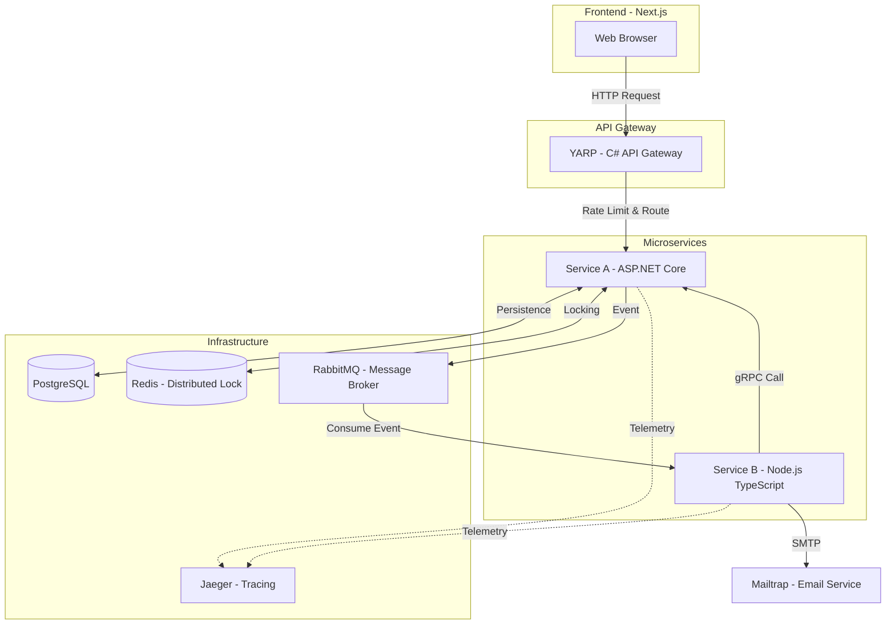

# 🏗️ System Architecture

ไฟล์นี้อธิบายโครงสร้างและการไหลของข้อมูลภายในระบบ Concert Ticket Booking

## 📊 System Overview Diagram

## 💡 Key Architectural Decisions

1. **API Gateway (YARP):** ใช้เพื่อทำ Centralized Entry Point และจัดการ Cross-Cutting Concerns เช่น Rate Limiting และ Correlation ID
2. **Distributed Locking (Redis):** เพื่อจัดการสภาวะการแย่งชิงทรัพยากร (Race Condition) ในระบบที่มีผู้ใช้จำนวนมาก
3. **Event-Driven Architecture (RabbitMQ):** เพื่อทำ Decoupling ระหว่างระบบจองและระบบแจ้งเตือน ช่วยเพิ่ม Scalability และ Availability
4. **gRPC for Internal Comm:** เลือกใช้ gRPC เพราะต้องการประสิทธิภาพสูงสุดในการแลกเปลี่ยนข้อมูลระหว่าง Microservices
5. **Observability (Jaeger):** เพื่อช่วยในการ Debug และ Monitoring ระบบที่มีความซับซ้อนแบบ Distributed System